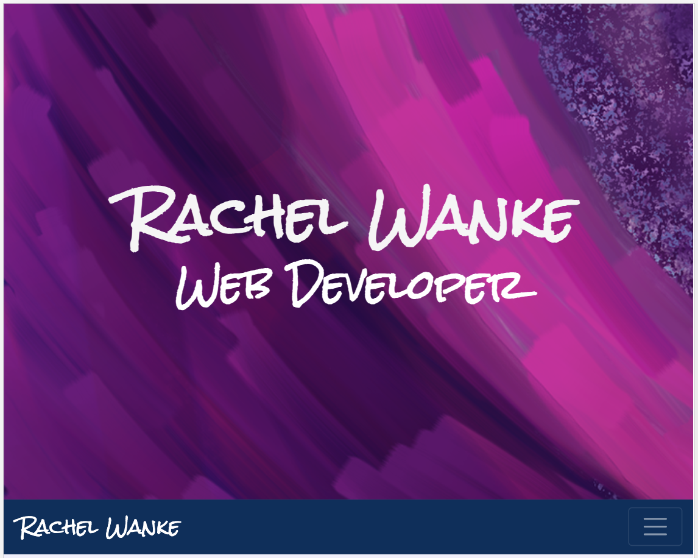
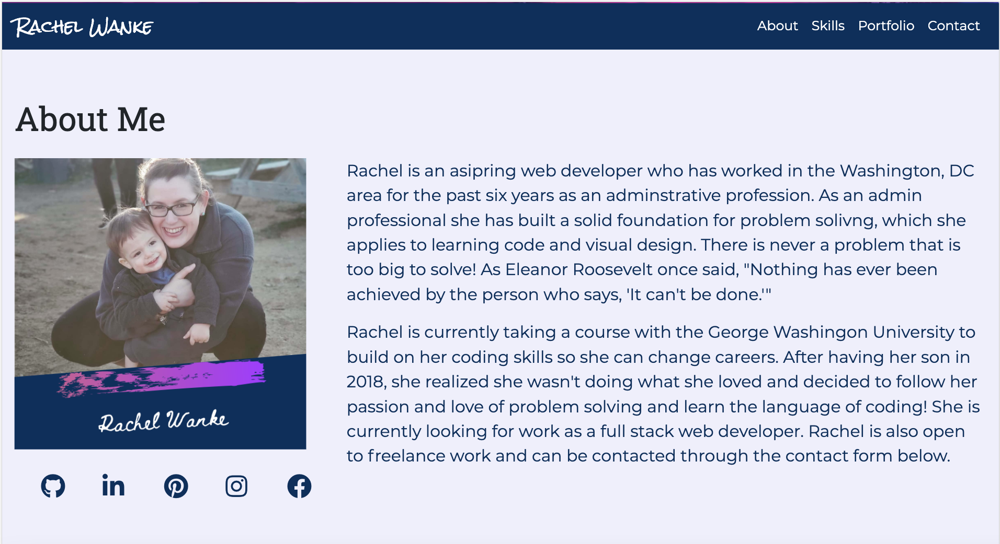
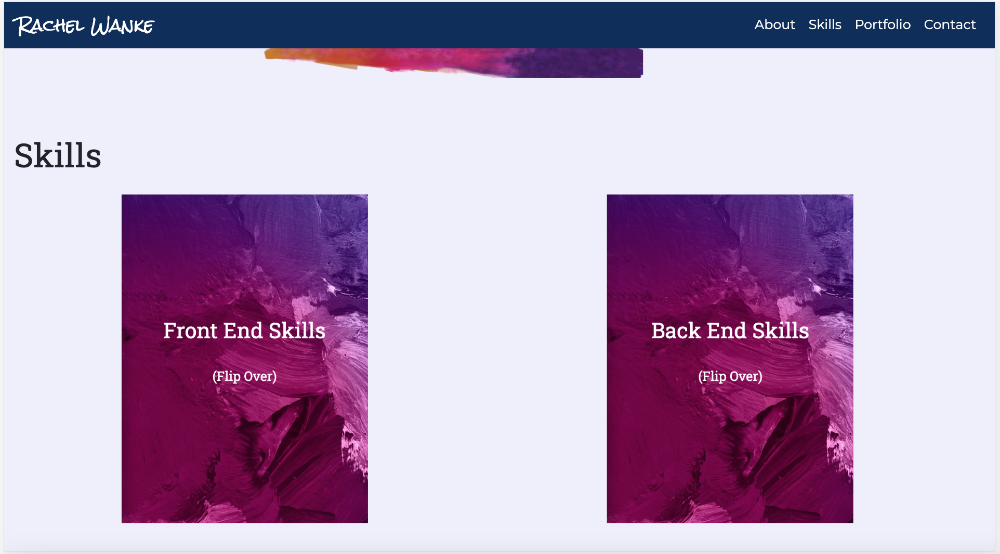
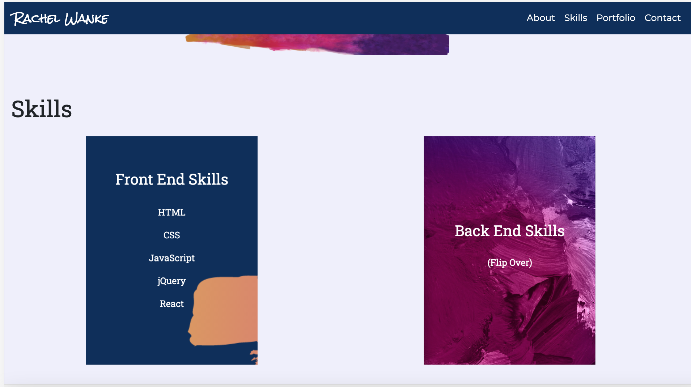
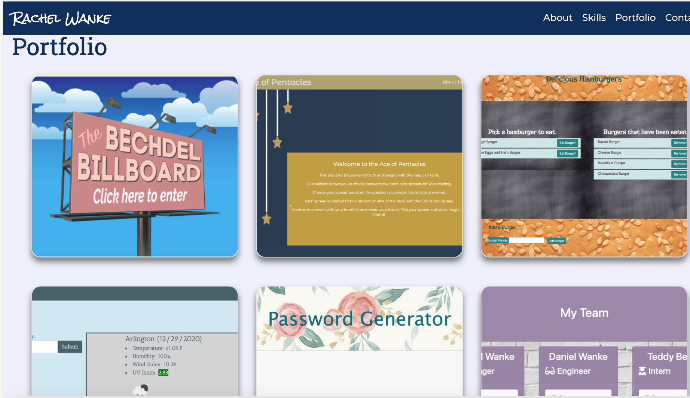
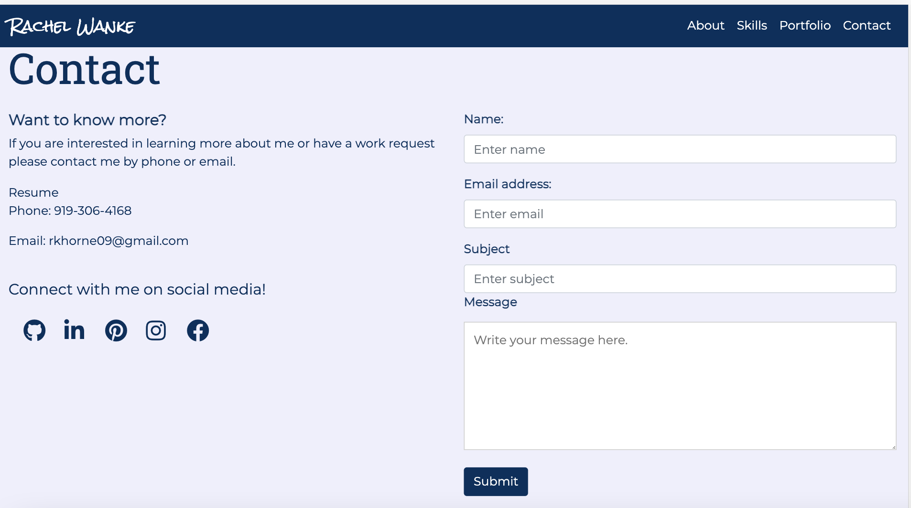

# Rachel Wanke - Portfolio

### Version 1.0

 

## License:
 

 

## Description

This application is my own portfolio page. It is styled in a one page format with links to each section in the navbar. The graphics are created by using canva, Adobe Photoshop, and Paint Essentials 8.0. The flip card images are from the internet. 

This website uses mostly HTML and CSS, but it does use nodemailer for the contact form and it's run on a server using express and Node.js. 

 

## Installation and Instructions

        1. Load Packages:

            npm init

        2. Run Application:

            npm start
 

## Requirements

        1. Install Dependencies:

            npm install express
            npm install dotenv
            npm install nodemailer
            npm install nodemailer-mailgun-transport

 

## Link to application:

https://rachelwanke14.herokuapp.com/

 

## Link to repository:

https://github.com/rwanke14/portfolio2.0

 

## Screenshots of Application:

 

 

 

 

 

 

